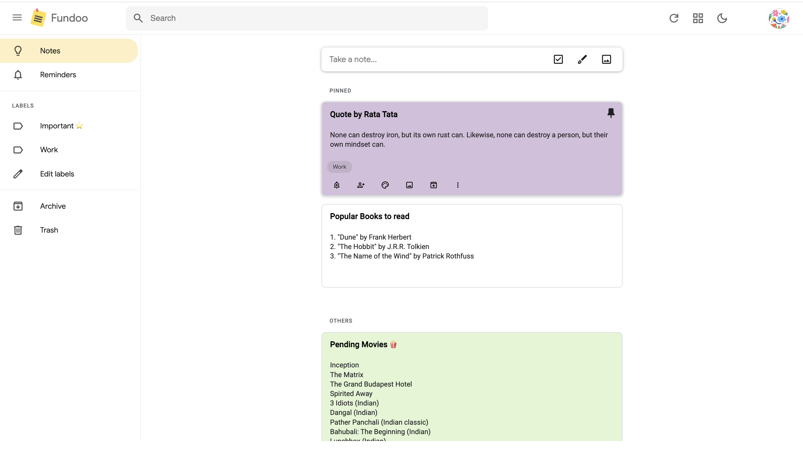

# Fundoo Notes - A Note-Taking App

https://visnu1.github.io/fundoo/ 

**Note: This application is a personal project created solely for educational purposes and to demonstrate my skills. It is not intended for any commercial use, and I do not claim any affiliation with or permissions from Google or any other entities. This project is a clone of Google Keep, and I do not intend to sell, monetize, or distribute it for any profit. All rights to the original Google Keep platform and its intellectual property belong to Google LLC.** 

## Introduction
**Fundoo Notes** is a simple and intuitive note-taking application inspired by Google Keep. It allows users to create, edit, organize, and delete notes effortlessly. The app is built using the **MEAN** stack, which includes **MongoDB**, **Express.js**, **Angular**, and **Node.js**.

This project is perfect for those who want a full-featured notes app for personal use or to learn about building a CRUD application with the MEAN stack

## Screenshots

## Features
- **Create Notes**: Add new notes with text and titles.
- **Edit Notes**: Modify existing notes quickly.
- **Delete Notes**: Permanently delete any note.
- **Labels & Categories**: Add labels to organize your notes.
- **Search Notes**: Easily find notes using keywords.
- **Archive & Trash**: Archive notes for later and manage trashed notes.
- **Responsive Design**: Works seamlessly across all devices.

## Tech Stack
- **Frontend**: Angular
- **Backend**: Express.js & Node.js
- **Database**: MongoDB
- **Styling**: SCSS and Angular Material for UI components
